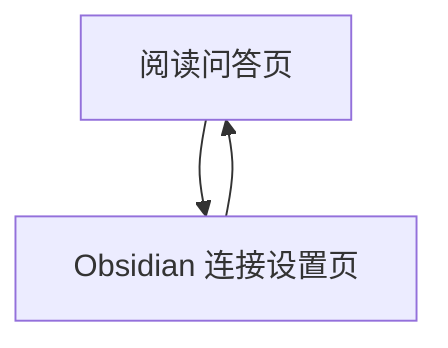

## 1. Product Overview
面向个人知识管理的“文档阅读 + 即时问答”工具：上传 PDF/Word 后在页面预览，边读边向 AI 提问并得到回答。
支持一键把 AI 回答写入 Obsidian；并让 AI 具备读取/搜索/写入 Obsidian 笔记的能力以增强回答质量。

## 2. Core Features

### 2.1 Feature Module
本产品最小可用版本包含以下页面：
1. **阅读问答页**：PDF/Word 上传与预览、文档内搜索/定位、选中文本提问、对话式问答、一键保存回答到 Obsidian、使用 Obsidian 作为知识库检索/引用。
2. **Obsidian 连接设置页**：配置并测试 Obsidian 访问、选择目标 Vault/路径/笔记、提供读取/搜索/写入能力的权限与范围设置。

### 2.2 Page Details
| Page Name | Module Name | Feature description |
|---|---|---|
| 阅读问答页 | 文件上传 | 选择并上传本地 PDF 或 Word(.docx) 文件；校验格式与大小；支持重新选择文件覆盖当前会话。 |
| 阅读问答页 | 文档预览 | 在页面渲染 PDF（分页/缩放/跳页）或 Word（转换为可滚动 HTML）；显示加载进度与失败提示。 |
| 阅读问答页 | 文档内检索与定位 | 在当前文档中搜索关键词；高亮命中；支持跳转到上一/下一处命中（PDF 跳页、Word 滚动定位）。 |
| 阅读问答页 | 选区提问 | 允许用户在预览区选择一段文字作为“引用上下文”；将选区与用户问题一起发送给 AI。 |
| 阅读问答页 | 边读边问对话 | 提供聊天面板：输入问题、展示 AI 回答；支持连续追问；每条回答可复制。 |
| 阅读问答页 | Obsidian 一键保存 | 对任一 AI 回答点击“保存到 Obsidian”：选择保存方式（新建笔记/追加到现有笔记）、目标路径与标题（可编辑）；写入成功/失败反馈。 |
| 阅读问答页 | 使用 Obsidian 作为技能 | 在提问时可开启“从 Obsidian 检索”：根据问题检索笔记并把命中片段作为参考上下文；可按需读取指定笔记全文；可在用户确认后写入总结/要点到指定笔记。 |
| Obsidian 连接设置页 | 连接配置 | 填写 Obsidian 本地 API 地址（如 localhost）与访问令牌/密钥（如有）；保存到本地（浏览器存储）并支持一键清除。 |
| Obsidian 连接设置页 | 连接测试 | 点击“测试连接”验证：可列出 Vault/根目录、执行一次搜索、读取一篇示例笔记、写入一条测试内容；输出可读的错误原因。 |
| Obsidian 连接设置页 | 范围与安全 | 设置允许访问的 Vault/目录白名单；写入模式开关（只读/可写）；默认只读，写入需要在阅读问答页逐次确认。 |

## 3. Core Process
**阅读问答主流程**：你在阅读问答页上传 PDF/Word → 文档在页面中预览 → 你边阅读边选中文本或直接输入问题 → 系统将“问题 + 选区/当前页文本（可选）+（可选）Obsidian 检索结果”发送给 AI → 展示回答 → 你可一键把回答保存到 Obsidian 的新笔记或既有笔记。

**Obsidian 增强回答流程**：你先在 Obsidian 连接设置页完成连接与测试 → 回到阅读问答页开启“从 Obsidian 检索” → 系统按问题检索笔记并展示命中摘要 → AI 回答时引用这些摘要 → 若你点击“写入 Obsidian”，系统在你确认后把回答/摘要追加到目标笔记。

