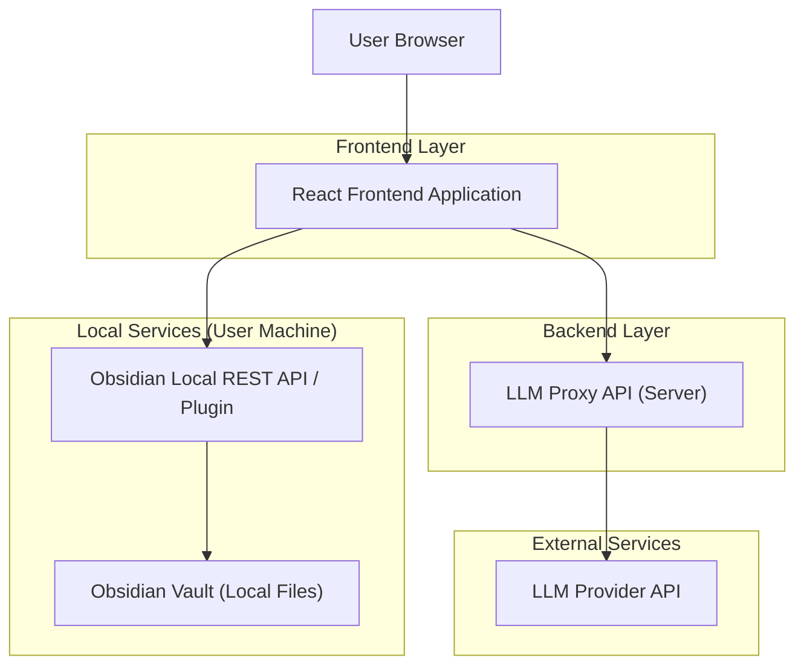
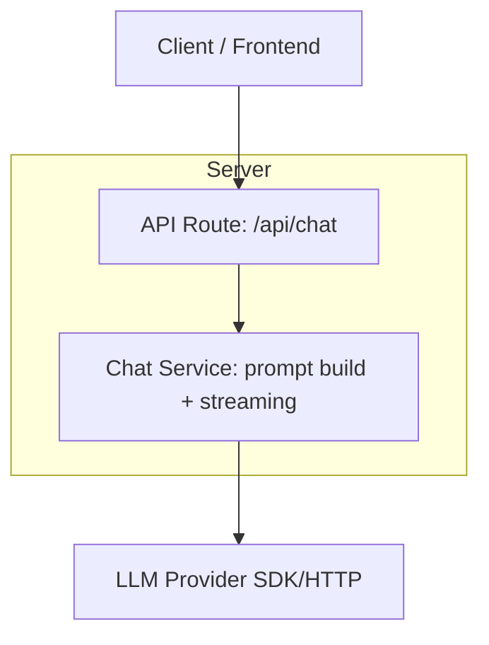

## 1.Architecture design


## 2.Technology Description
- Frontend: React@18 + vite + tailwindcss@3
- Frontend (文档预览): pdfjs-dist（PDF 渲染）+ mammoth（.docx 转 HTML）
- Frontend (状态与体验): zustand（可选）+ react-router
- Backend: 轻量 LLM 代理服务（Node.js/Express 或 Supabase Edge Functions 二选一）
  - 目的：安全存放并调用 LLM API Key；支持流式返回（SSE/WebSocket 选其一）
- Obsidian 集成: Obsidian 侧需提供本地可调用的 API（推荐 Obsidian 插件或本地 Companion 服务）
  - 能力：search / read note / write(append, create)
  - 注意：后端无法直接访问用户本地 Vault，因此 Obsidian 操作应由前端直连本地 API 完成（或由本地 companion 完成），并在用户授权范围内执行。

## 3.Route definitions
| Route | Purpose |
|---|---|
| / | 阅读问答页：上传并预览 PDF/Word，边读边问，一键保存到 Obsidian |
| /settings/obsidian | Obsidian 连接设置页：配置/测试连接，设置访问范围与写入开关 |

## 4.API definitions (If it includes backend services)
### 4.1 Core API
对话问答（支持文档片段与 Obsidian 片段作为上下文）
```
POST /api/chat
```

Request (TypeScript)
```ts
type ChatMessage = { role: 'system' | 'user' | 'assistant'; content: string };

type DocContext = {
  source: 'pdf' | 'docx';
  selectionText?: string;      // 用户选区
  currentPageText?: string;    // 可选：当前页抽取文本
  meta?: { fileName?: string; page?: number };
};

type ObsidianContextSnippet = {
  notePath: string;
  title?: string;
  snippet: string;
};

type ChatRequest = {
  messages: ChatMessage[];
  doc?: DocContext;
  obsidianSnippets?: ObsidianContextSnippet[]; // 前端检索后传入
};
```

Response
```ts
type ChatResponse = {
  answer: string;
  citations?: Array<{ kind: 'document' | 'obsidian'; ref: string }>;
};
```

## 5.Server architecture diagram (If it includes backend services)


## 6.Data model(if applicable)
不强制需要数据库即可完成：上传文件仅用于当前会话预览；对话与保存动作默认不落库。
如后续需要跨设备同步，可再引入 Supabase Database/Storage 存储会话、文件与 Obsidian 写入记录。
