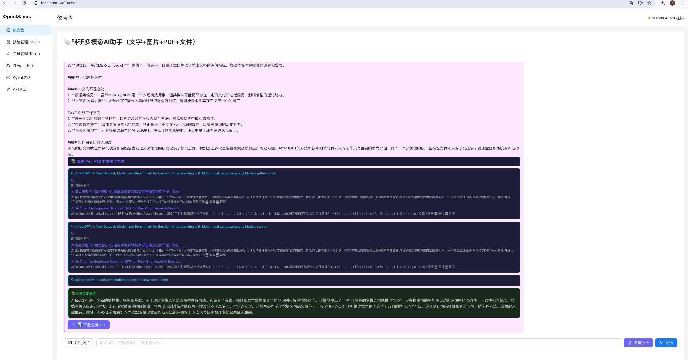

# LuminAgent - 智能代理框架

一个基于OpenManus的智能代理框架，提供文档阅读问答、代码生成、数据可视化等功能。

## 项目结构

```
LuminAgent/
├── OpenManus/                # 后端服务
│   ├── app/                  # 应用核心代码
│   │   ├── agent/            # 代理模块
│   │   ├── flow/             # 流程管理
│   │   ├── mcp/              # MCP服务器
│   │   ├── prompt/           # 提示词模板
│   │   ├── sandbox/          # 沙盒环境
│   │   ├── skills/           # 技能模块（待完善）
│   │   ├── tool/             # 工具集合（更多工具待添加）
│   │   └── utils/            # 工具函数
│   ├── config/               # 配置文件
│   ├── examples/             # 使用示例
│   └── protocol/             # 协议定义
├── openmanus-frontend/       # 前端界面
│   ├── public/               # 静态资源
│   └── src/                  # 源代码
│       ├── api/              # API接口
│       ├── layout/           # 布局组件
│       └── pages/            # 页面组件
└── README.md                 # 项目说明
```

## 功能特点

- 🧠 **智能代理**: 基于OpenManus的强大代理能力
- 📚 **文档问答**: 支持多种格式文档的阅读和问答
- 💻 **代码生成**: 自动生成代码和执行能力
- 📊 **数据可视化**: 支持图表生成和数据展示
- 🌐 **Web搜索**: 集成多种搜索工具
- 🔍 **浏览器自动化**: 支持网页浏览和操作
- 📱 **响应式前端**: 现代化的Web界面

## 技术栈

### 后端
- Python 3.12+
- OpenManus 代理框架
- FastAPI (待集成)
- 支持多种LLM模型 (GPT-4, Claude, Gemini等)

### 前端
- React 18+
- Tailwind CSS
- Axios (API调用)

## 快速开始

### 1. 克隆仓库

```bash
git clone git@github.com:CeilingHan/LuminAgent.git
cd LuminAgent
```

### 2. 安装后端依赖

```bash
cd OpenManus

# 使用uv（推荐）
uv venv --python 3.12
source .venv/bin/activate
uv pip install -r requirements.txt

# 或使用pip
pip install -r requirements.txt
```

### 3. 配置环境

```bash
cp OpenManus/config/config.example.toml OpenManus/config/config.toml
# 编辑config.toml，添加您的API密钥
```

### 4. 运行后端服务

```bash
cd OpenManus
python web_server.py
```

### 5. 运行前端服务

```bash
cd openmanus-frontend
npm install
npm start
```

## 模块说明

### 已实现模块

| 模块 | 功能 | 状态 |
|------|------|------|
| Agent | 智能代理核心 | ✅ |
| Tool | 工具调用系统 | ✅ |
| Flow | 流程管理 | ✅ |
| Sandbox | 沙盒环境 | ✅ |
| MCP | MCP协议支持 | ✅ |

### 待实现模块

| 模块 | 功能 | 状态 |
|------|------|------|
| Memory | 记忆模块 | 🔄 |
| Skills | 技能系统 | 🔄 |

## API接口

### 代理调用

```bash
POST /api/agent/execute
Content-Type: application/json

{
  "task": "分析这个数据文件",
  "files": ["data.csv"]
}
```

### 工具列表

```bash
GET /api/tools/list
```

## 使用示例


## 配置说明

### 支持的LLM模型

- qwen
- deepseek
- Ollama (待完善)
### 配置文件示例

```toml
[llm]
model = "qwen"
base_url = "https://api.qwen-plus.com/v1"
api_key = "sk-..."
max_tokens = 4096
temperature = 0.0
```

## 贡献指南

欢迎贡献代码！请遵循以下步骤：

1. Fork仓库
2. 创建功能分支
3. 提交代码
4. 创建Pull Request

### 开发规范

- 使用pre-commit进行代码检查
- 遵循PEP8编码规范
- 添加必要的测试用例
- 更新相关文档

## 许可证

MIT License

## 联系方式

- GitHub: https://github.com/CeilingHan
---

**用AI创造无限可能** 💡
